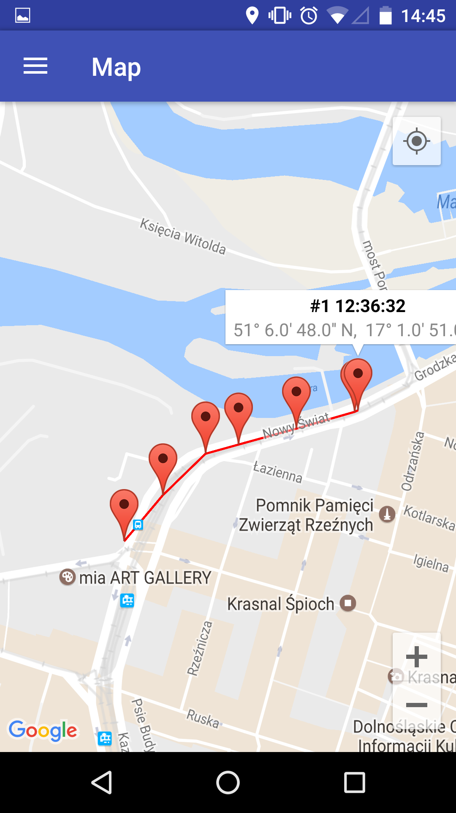
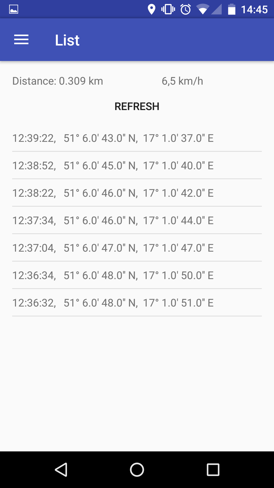
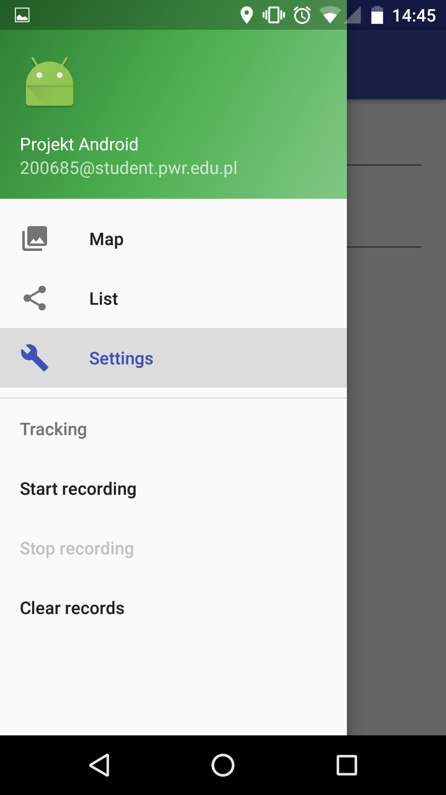

# GPSTracker
Programowanie aplikacji mobilnych oraz usług internetowych

Aplikacja służy do nagrywania pojedynczej trasy ze śladów lokalizacji użytkownika. Lokalizacja jest odczytywana przez serwis w tle (implementujący interfejs LocationListener), który pobiera dane z sensora GPS lub sieci komórkowych. Serwis potrafi w czasie trwania śledzenia zmienić źródło danych (np. gdy użytkownik nagle wyłączy GPS w celu oszczędzania energii) bez zatrzymywania swojego działania. Nagrywanie trasy odbywa się po aktywowaniu opcji z wysuwanego menu "Start recording" (NavigationDrawer), może zostać natomiast zatrzymane poprzez wybranie opcji "Stop recording". Z poziomu menu możliwe jest usunięcie punktów zapisanych w mobilnej bazie SQLite. Aplikacja składa się z trzech fragmentów: listy, ustawień i mapy. Zapisane punkty pokazywane są na mapie jako znaczniki, zawierający krótki opis widoczny po kliknięciu na nie (godzina, szerokość i długość geograficzna skonwertowane do formatu DMS). Jeżeli zapisano więcej niż jeden punkt, na mapie zaczyna być rysowana trasa pomiędzy znacznikami w postaci czerwonej linii. Dane można przegląd również w postaci tesktowej na liście. Liczony jest przebyty dystans (suma odległości pomiędzy punktami) oraz czas (różnica pomiędzy czasem zakończenia śledzenia, a jego rozpoczęcia). Na ich podstawie wyliczana jest średnia prędkość, z jaką poruszał się użytkownik.

# Założenia projektu
* Wyświetlanie bieżącej pozycji na mapie
* Okresowe śledzenie lokalizacji użytkownika
* Wyświetlanie zapisanej trasy za pomocą znaczników
* Obliczanie długości trasy i średniej prędkości użytkownika
* Możliwość zmiany ustawień interwału przez użytkownika
* Wykorzystanie wbudowanego sensora do zliczania kroków
* Mobilna baza danych SQLite do składowania danych

# Zrzuty ekranowe
Ekran główny z mapą i "dymkami"

Lista zapisanych punktów, pomiar odległości i prędkości średniej

Wysuwane menu główne

